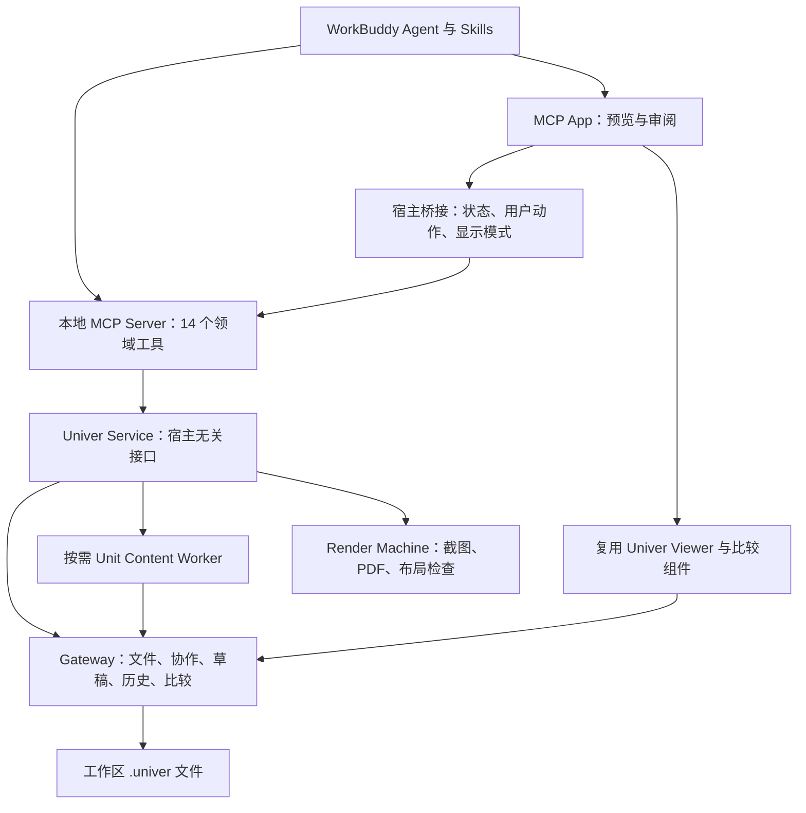

# WorkBuddy Univer Office 插件调研

> 2026-09-09 范围更正：用户明确 `dsh-univer-office` 仅作交互参考，实际实现使用附件指定的 Office SDK。下文关于移植或复用 DSH 应用源码的建议已被取代；当前实现依据是 [workbuddy-univer-office spec](./workbuddy-univer-office-spec.md)。本文保留为早期调研记录。

调研日期：2026-09-09。状态：源码与官方文档调研完成，尚未开发或进行 WorkBuddy 客户端联调。

## 结论

建议采用 **WorkBuddy 插件/连接器 + 本地 MCP Server + MCP App Viewer**，复用 `dsh-univer-office` 的办公引擎、Gateway、内容 Worker、渲染器与比较组件，替换 DSH 宿主适配层。

核心办公功能具有明确的迁移路径；“全部功能对齐”还包括对话内审阅、自动浮窗、历史卡片和会话隔离。这些不能仅凭 MCP 工具可调用就判定完成。官方已有 MCP Apps 文档，但其中具体宿主行为描述针对 CodeBuddy Web UI，必须在目标 WorkBuddy 桌面版本验证。

首个开发里程碑应验证真实 Viewer 在 WorkBuddy 中的嵌入、实时更新、审批和任务恢复，再开展完整迁移。外部浏览器预览可以作为兼容方案，但不计为对话内体验对齐。

## 调研基线与证据范围

- 上游仓库：[`dream-num/dsh-univer-office`](https://github.com/dream-num/dsh-univer-office)。
- 固定提交：[`f3a8845dd4c863072b0ae555cdb6a58076c165e7`](https://github.com/dream-num/dsh-univer-office/tree/f3a8845dd4c863072b0ae555cdb6a58076c165e7)，package version `0.2.14`。
- 读取了架构文档、14 个工具定义的接口、Provider/Service、工作区授权、构建配置、客户端状态投影说明及比较组件清单。
- 当前工作区是空 Git 仓库；参考仓库仅克隆到临时目录，没有加入 submodule。
- 本机 `/Applications` 下未发现名称含 Buddy 的应用，未发现 `~/.workbuddy`；这不排除其他位置存在安装。未运行 WorkBuddy 客户端验证。
- 未安装上游依赖、未启动 Node 服务、未执行全量构建。下述“可复用”是源码判断，不代表运行验证已通过。

今后上游更新应另做增量差异检查，不能把移动的 `main` 当作固定验收标准。

## 1. 参考项目真正包含什么

### 1.1 内容能力

| 对齐项 | 必须覆盖的能力 | 交付与检查边界 |
|---|---|---|
| Sheet | 单元格、公式、样式、表格、图表、透视表、筛选、校验、条件格式、迷你图、图片 | 导入/导出 XLSX、CSV、TSV；结构读取、重算、范围截图、PDF |
| Doc | 段落、富文本、列表、任务、表格、图片、图表、页眉页脚、分页和页面布局 | DOCX 导入/导出；结构读取、分页截图、PDF |
| Slide | 页面、文本、形状、图片、表格、图表、SVG 页面编译和转场 | PPTX 导入/导出；结构读取、真实布局 lint、逐页截图、联系表、PDF |
| Base | 表、字段、记录、视图、公式字段、筛选、排序、分组、Sheet 引用 | 结构检查、工作台截图；导出 XLSX、CSV、TSV；不承诺 Base 导入或 PDF |
| Board | 形状、文本、连接线、图片、原生图表、连接线路由和布局分析 | 结构检查、区域/元素截图、PDF；不承诺独立文件导出 |
| 混合内容 | 一个 `.univer` 文件包含五类 Unit；跨 Unit 公式与嵌入引用 | 检查引用的数据和图片在编辑、渲染、导出时均能正确装配 |

依据：[固定版本 README](https://github.com/dream-num/dsh-univer-office/blob/f3a8845dd4c863072b0ae555cdb6a58076c165e7/README.md)、[内容 Worker](https://github.com/dream-num/dsh-univer-office/blob/f3a8845dd4c863072b0ae555cdb6a58076c165e7/src/workers/unit-content/entry.ts)。

上游明确未开放 Slide 母版、版式页和演讲备注，以及 Board 思维导图、表格、墨迹和部分高级编辑。依赖中出现相关 SDK 不代表插件已经支持，首版不应擅自扩大这部分范围。

### 1.2 14 个模型工具

保留原始工具名与业务语义；WorkBuddy 显示时可能添加 MCP 命名空间。参数必填、互斥约束、错误码、取消语义和结果结构也要纳入迁移。

| 工具 | 对齐内容 | 关键约束 |
|---|---|---|
| `univer_new` | 新建空 `.univer` 容器 | 不覆盖已有文件，不自动创建 Unit |
| `univer_status` | 文件、Unit、worktree 状态 | 返回后续调用需要的明确 ID |
| `univer_worktree` | create / ready / reopen / merge / discard | merge/discard 必须有明确用户授权 |
| `univer_unit` | 创建/删除五类顶层 Unit | 修改目标为明确 draft；创建要求 kind/name |
| `univer_import` | Office 文件导入指定草稿 | 来源路径经过工作区授权 |
| `univer_inspect` | 范围、结构、Base/Board 概览和元素检查 | 明确 Unit；可指定 worktree |
| `univer_execute` | 执行 Univer Facade JavaScript | code/codeFile 二选一；明确 draft 与 Unit；显式 return 回读 |
| `univer_export` | 导出受支持的 Office/表格格式 | 工具可读 trunk 或指定 worktree；输出路径授权 |
| `univer_lint` | Slide 越界、文本溢出和重叠检查 | 返回 coverage/findings，不等同于截图 |
| `univer_compile_svg` | SVG 编译并应用到 Slide 页面 | 明确页面和 draft；字体测量依赖浏览器 |
| `univer_screenshot` | 五类 Unit 截图及模型图像回读 | Sheet 范围；Doc/Slide 页面；Slide 联系表；Board 区域/元素 |
| `univer_print_pdf` | Sheet/Doc/Slide/Board PDF 打印 | 不包含 Base；保存到授权工作区 |
| `univer_api` | 精确版本 API 搜索和引用查询 | 与实际 SDK 版本匹配 |
| `univer_resources` | 图标、Logo、Emoji、插画搜索/读取/导出 | 内置 registry，持久缓存，下载取消与输出授权 |

依据：[工具定义目录](https://github.com/dream-num/dsh-univer-office/tree/f3a8845dd4c863072b0ae555cdb6a58076c165e7/src/host/tools/definitions)、[工具注册与审批拦截](https://github.com/dream-num/dsh-univer-office/blob/f3a8845dd4c863072b0ae555cdb6a58076c165e7/src/host/tools/plugin.ts)。上游截图工具还依赖 DSH attachment 服务；迁移后需要实现 MCP 图像结果和持久文件回读，不能仅返回路径。

### 1.3 审阅、预览与历史

以下各行都属于最终范围，而不是可删除的装饰功能。

| 对齐项 | 上游行为 | WorkBuddy 实现判断 |
|---|---|---|
| 草稿生命周期 | 编辑 draft → ready → 用户 merge/discard；继续编辑用 reopen | Gateway 复用，宿主授权重接 |
| 实时预览 | 写入过程中 Viewer 随 Gateway 更新 | Viewer/WebSocket 可复用；沙箱连接待验证 |
| 浮窗 | 自动打开，可拖动、缩放、折叠、最大化 | MCP Apps pip 是候选；自动弹出和跨回合持续性待验证 |
| 对话卡片 | 每个文件保留完整预览；旧回合默认折叠 | MCP App 可提供卡片内容；位置、去重和旧卡片控制待验证 |
| 全屏 | 完整 Viewer、退出全屏行为 | MCP Apps fullscreen 是候选 |
| Unit 切换 | 草稿只列出有改动的 Unit | 复用 Viewer 和结构化状态 |
| View/Compare | 草稿与 trunk 或其他活跃草稿双栏语义比较 | 复用比较 Gateway 与 React 组件 |
| 固定比较版本 | 打开时固定两侧 revision，变化后提示 stale，用户显式刷新 | 保留比较会话协议 |
| 差异导航 | 五类 Unit 的语义差异列表、分页/筛选、实体定位 | 复用已有比较组件 |
| 审阅按钮 | 在完整 Viewer 内 ready/reopen/merge/discard | 宿主桥接必须保留用户操作来源和授权 |
| 终态展示 | merged/discarded 保留历史卡片，退出浮窗并显示主线 | 需要持久状态与恢复入口 |
| 删除临时文件 | 文件已删除时不残留卡片 | 卡片状态可检查；能否从宿主移除卡片待验证 |
| 会话隔离 | 文件目标、窗口和审阅状态按会话隔离 | 必须取得可信 task/workspace scope |
| 展示偏好 | 可关闭自动浮窗，仍保留审阅卡片 | 自建插件配置映射，验证即时生效 |
| 多语言 | 宿主外壳和 Viewer 中英文同步 | MCP locale 可作为输入；桌面语言来源待验证 |
| Ribbon 导入/导出 | 主线视图开放；draft/review 不开放；Board 仅打印 | 复用现有 Viewer 权限分支 |
| 版本历史 | 五类 Unit 主线历史；只读可查看，可编辑视图可显式恢复 | Gateway History 与 Viewer History UI 复用 |
| 空文件 | 无 Unit 时显示空状态 | 复用 Viewer |
| 会话恢复 | 由持久工具结果恢复目标与生命周期 | 要验证重启后的资源重读、服务重启和 URL 更新 |

依据：[架构要求及客户端边界](https://github.com/dream-num/dsh-univer-office/blob/f3a8845dd4c863072b0ae555cdb6a58076c165e7/docs/architecture.md)、[回合状态投影](https://github.com/dream-num/dsh-univer-office/blob/f3a8845dd4c863072b0ae555cdb6a58076c165e7/docs/univer-turn-projection-and-surfaces.md)、[比较组件](https://github.com/dream-num/dsh-univer-office/tree/f3a8845dd4c863072b0ae555cdb6a58076c165e7/packages/unit-comparison-viewer)。

### 1.4 配套能力

- 保留 8 个领域 Skill 的覆盖范围：univer、sheet、doc、slide、base、board、embed、cross-unit-formula；重写宿主名称、工具引用和审批描述。
- 保留 Gateway 按需启动、端口占用递增、启动去重、健康检查、取消和清理。
- 保留逐工作区 realpath 校验，包括输入文件、codeFile、SVG、图片资源和输出文件。
- 保留超时、截图页数/像素限制、资源下载缓存和启用开关；缓存目录改为 WorkBuddy 插件持久目录。
- 上游有匿名遥测与停用机制；迁移需独立事件来源和配置，不能继续报作 DSH。卸载回调是否可用需宿主验证。

配置基线：端口 9080；启动 10 秒；状态读取 3 秒；写操作 60 秒；内容/截图/PDF/资源整体操作 120 秒；资源下载 15 秒；截图最多 30 页，每图最多 16,777,216 像素；提交确认 5 秒；文件状态缓存 1 秒，Unit 缓存 5 秒。[配置源码](https://github.com/dream-num/dsh-univer-office/blob/f3a8845dd4c863072b0ae555cdb6a58076c165e7/src/host/config.ts)

## 2. WorkBuddy 的接入路径

### 插件包与连接器包

WorkBuddy 官方说明支持 Skill、MCP、Hook 等插件，并允许添加第三方市场。[WorkBuddy 插件系统](https://www.codebuddy.cn/docs/workbuddy/Plugins)

CodeBuddy 插件规范识别 `.workbuddy-plugin/plugin.json`，组件放在插件根目录，MCP 可通过 `.mcp.json` 或 manifest 声明。其插件目录变量和持久目录变量有明确规范，但不能据此假设 WorkBuddy 每个桌面版本完全相同。[插件参考](https://www.codebuddy.cn/docs/cli/plugins-reference)

WorkBuddy 开放平台另有连接器分发格式：`connector-meta.json`、`mcp.json`、图标和可选 skills。推荐 MCP + Skill；一个连接器只配置一个 MCP Server。本地 stdio 可声明 Node runtime，相关字段最低 WorkBuddy 版本为 5.0.0。文档中的 `timeout` 是连接超时，不能当作工具执行时限。[连接器开发文档](https://open.workbuddy.cn/docs/connector)

建议先产出一个本地 MCP 运行包，分别生成插件市场包装和连接器市场包装，并在 PoC 中比较两条注册路径。它们是同一实现的不同分发方式；不要让用户同时启用两份重复工具。插件路径能发现工具，不必然意味着桌面端的 MCP App 渲染链路也已接通。

### MCP Apps 能提供什么

官方 CodeBuddy Web UI 文档定义了 HTML 资源与工具关联、沙箱内运行、工具结果推送、反向工具调用，以及 inline/fullscreen/pip 显示模式。对应入口是 `_meta.ui.resourceUri` 和 `text/html;profile=mcp-app`。这提供了 Viewer 接入的技术候选，但不是 WorkBuddy 桌面版本的兼容测试结果。[MCP Apps 接入指南](https://www.codebuddy.cn/docs/cli/mcp-apps)

WorkBuddy 开放平台也将 MCP Apps 列为已有服务接入 Buddy 应用的方式。Buddy 应用属于更大的品牌工作台配置，本项目无需为了办公插件直接扩大为完整 Buddy 应用。[Buddy 应用文档](https://open.workbuddy.cn/docs/buddy-app)

PoC 必须测量：沙箱 CSP 对动态本机端口、静态资源、WebSocket 和嵌套 Viewer 的限制；优先直接把 Viewer 挂进 MCP App，减少额外 iframe 层。所有动态资源地址都由已授权服务生成。

## 3. 推荐实现结构

这是建议结构，尚未实现。开发初期保持一个项目和一个运行包，不为目录分层提前拆多个发布包。

| 现有模块 | 迁移方式 | 具体改动 |
|---|---|---|
| `gateway-app` | 高度复用 | 保留 SQLite 文件、协作、exchange、历史与比较协议；改启动入口 |
| `workers/unit-content` | 高度复用 | 保留内容执行/检查/转换；重接路径与生命周期 |
| `render-machine` / `viewer-support` | 高度复用 | 保留五类内容渲染与引用资源装配 |
| `viewer-app` | 主体复用 | 宿主 bridge、静态资源加载、配置及 CSP 适配 |
| `packages/unit-comparison-viewer` | 源码复用 | 当前是 private 包；不能假设可独立 npm 安装 |
| `host/provider` / `adapters` / `processes` | 局部改造 | 移除 Cordis 生命周期，保留领域操作、缓存、进程管理 |
| `host/service` | 接口保留、宿主类型替换 | 去除 Cordis Service 继承与 HarnessError 依赖 |
| `host/tools` | 重写注册外壳 | 转 JSON Schema、MCP content/structuredContent、取消与错误 |
| `host/webServer` | 替换 | WorkBuddy scope 解析及审阅动作授权 |
| `client` | 主要重写 | DSH 会话投影、浮窗、设置和卡片注册无法直接使用 |
| `skills` | 内容迁移 | 保留领域流程，调整工具命名与宿主交互 |
| 构建/安装/遥测 | 改造 | WorkBuddy 运行时、跨平台产物、缓存和事件来源 |

上述判断来自源码依赖检查：Service 继承 Cordis，Provider 构造依赖 Context 和 effect 清理，错误类型继承 DSH HarnessError，工具使用 DSH defineTool；因此不能仅把 `dsh` 字符串改成 `workbuddy`。[Service](https://github.com/dream-num/dsh-univer-office/blob/f3a8845dd4c863072b0ae555cdb6a58076c165e7/src/host/service/univer-service.ts)、[Provider](https://github.com/dream-num/dsh-univer-office/blob/f3a8845dd4c863072b0ae555cdb6a58076c165e7/src/host/provider/gateway-univer-service.ts)

不建议通过调用全局 Univer CLI 重做全部功能：上游已内置 Worker，继续使用同版本引擎更利于保持行为一致。也不建议依赖已发布 DSH 包的未导出内部路径；其公开 exports 没有提供完整独立 Service API。[package.json](https://github.com/dream-num/dsh-univer-office/blob/f3a8845dd4c863072b0ae555cdb6a58076c165e7/package.json)

## 4. 必须先解决的工程问题

### 4.1 可信会话与工作区

MCP 不会天然提供 DSH 的 `exec.session.cwd`。必须在客户端实测 roots、启动参数、环境变量、Hooks 或请求 metadata 中有哪些可信上下文。MCP 连接 ID 不应直接视为 WorkBuddy task ID。

建议保存 task → workspace → file → worktree 的授权映射。模型提供的 sessionId、绝对路径或 `approved: true` 都不能单独作为授权依据。原有 realpath 与越界路径拒绝逻辑应保留。

### 4.2 审批语义

原项目靠 DSH pre-execute 拦截 merge/discard，迁移 MCP 后这层会消失。WorkBuddy 宿主工具许可与“用户明确要合入哪个草稿”是两个不同状态。

设计时应把 Viewer 的具体用户动作与目标 revision 绑定；模型发起 merge/discard 时，如果无法从宿主验证具体授权，就返回待用户审阅状态。仅在 Skill 里写“请先询问”不足以实现原有边界。不要通过关闭宿主权限检查来解决接入问题。

### 4.3 持久卡片与端口变化

每条结果需保留稳定的 file/worktree/unit/revision 标识。历史卡片重开时重新取当前授权 Viewer 地址，不能只持久化含临时端口或临时凭证的 URL。

需要验证 MCP App 在工具调用结束后仍可更新、旧消息可重读资源、客户端重启能恢复服务。若宿主缺少回合尾卡片或浮窗控制接口，这就是全量体验对齐的待解决项，需要官方扩展支持，不能悄悄改为普通链接并宣称完成。

### 4.4 运行与分发

上游要求 Node >=22.19.0，使用平台相关的 SQLite、公式引擎、Office 转换器，并包含 Chromium 相关渲染依赖。开发基线应锁定上游精确 SDK/API Reference 版本，避免批量升级导致行为漂移。[运行与构建依赖](https://github.com/dream-num/dsh-univer-office/blob/f3a8845dd4c863072b0ae555cdb6a58076c165e7/package.json)

待验证：WorkBuddy 的 Node runtime 声明能否满足该最低版本；各目标 OS/CPU 的 native 包可安装性；Chromium 检测或下载；首次启动耗时；离线缓存；卸载时进程清理。上游 Apache-2.0 标注和依赖可下载事实，不替代对 Pro SDK/license 在新宿主分发范围的核对；本次未审计依赖授权条款。

保持一个受控 Gateway supervisor；内容 Worker 和浏览器任务设置并发上限，起步串行。开发时只构建改动目标，不运行整个 demo 集合。

### 4.5 长任务与图片返回

Office 转换、截图和 PDF 的上游操作预算可达 120 秒；需要分别验证 MCP 初始化超时、工具执行超时和取消传播，不能只提高配置中的连接超时。

验证 MCP ImageContent 能进入所选模型、分页截图的大小限制、图片持久化与任务恢复。若宿主需要异步 job/poll 扩展，保留原始任务结果和错误语义，并在对齐清单记录协议变化。

## 5. 开发里程碑与验收

分阶段是执行顺序，最终目标仍包含本报告全部对齐项。

| 阶段 | 交付物 | 完成门槛 |
|---|---|---|
| M0：宿主可行性 | 最小插件/连接器包 + 真实 Sheet Viewer + MCP App | 工具可调用、内嵌可编辑/审阅、实时更新、全屏/pip、明确用户合入、重启恢复；记录未支持的宿主交互 |
| M1：运行与工具 | 宿主无关 Service、Gateway/Worker、14 个 MCP 工具、8 个 Skills | 全部工具 schema/错误/取消可验证；不依赖全局 Univer CLI |
| M2：五类内容 | 完整 Viewer、导入导出、截图/PDF、资源/API、跨 Unit | 五类真实 fixture 通过结构回读与必要视觉检查 |
| M3：审阅体验 | 固定语义比较、历史、卡片恢复、会话隔离、设置和语言 | 双任务隔离、并行草稿、比较 stale/刷新、终态、删除文件、旧回合等场景通过 |
| M4：安装发布 | 可分发插件/连接器、平台安装测试、使用文档 | 干净机器安装闭环、升级/卸载检查、目标版本兼容矩阵 |

M0 未解决的完整体验项必须保持未完成，不应以 M1 工具数量齐全代替最终验收。人力与周期应在 M0 后估算；本次没有足够运行证据给出可靠工期或代码复用百分比。

### 最终验收样例

1. 薪资 Sheet：公式、条件格式、图表 → 截图回读 → ready → 用户合入 → XLSX 可打开。
2. 正式 Doc：富文本、表格、图表、页眉页脚 → 分页截图/PDF → DOCX 导出。
3. 六页 Slide：SVG 编译、文本/形状/表格/图表 → 每页 lint 和截图 → PPTX 导出。
4. 客户 Base：记录、公式、分组视图和 Sheet 引用 → 工作台截图 → CSV/XLSX 导出。
5. Board：形状、连接线、图片、图表 → 指定元素检查/截图 → PDF。
6. 同一文件混合 Sheet/Doc/Slide/Base/Board，验证跨 Unit 公式和嵌入更新。
7. 五类 Unit 分别验证新增、修改、删除的语义比较、定位，以及固定两侧 revision 和显式刷新。
8. 两个 WorkBuddy 任务打开不同工作区，同名文件与草稿不串状态；并行草稿合入行为正确。
9. ready 后 reopen，再编辑；merge/discard 缺乏用户授权时不执行；已获具体授权的操作正常完成。
10. 五类 Unit 主线历史查看、显式恢复；只读视图不允许恢复，草稿视图不错误暴露主线历史入口。
11. 自动浮窗开关、拖动/缩放/折叠/全屏、旧回合卡片、终态卡片、删除临时文件和中英文切换。
12. 端口占用、进程异常、取消、长任务超时、缺 Chromium、native 包失败、图片过大和非法路径都有可理解的错误。
13. 全新安装后完成创建→编辑→检查→审阅→导出；关闭并重启 WorkBuddy 后卡片恢复。
14. 更新后缓存与配置按设计保留；卸载清理自有进程，不影响工作区 `.univer` 文件或其他服务。

复用上游分层测试思路：领域测试尽量保留，DSH host/client 测试替换成 MCP/WorkBuddy 测试。源文件检查与文档存在不能替代实际客户端验收。

## 下一步建议

从 M0 开始，用实际目标 WorkBuddy 版本验证“一张 Sheet 的完整链路”。首先明确插件注册与连接器注册哪条路径能承载 MCP App，然后确认可信任务上下文、Viewer 网络边界和审阅恢复。通过后按本报告矩阵迁移完整功能。

本次只新增调研文档，没有提交 Git commit、PR、submodule 或安装插件。
