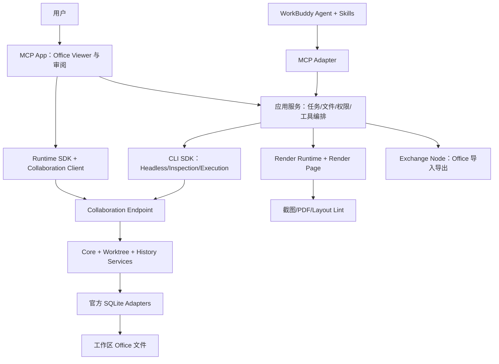
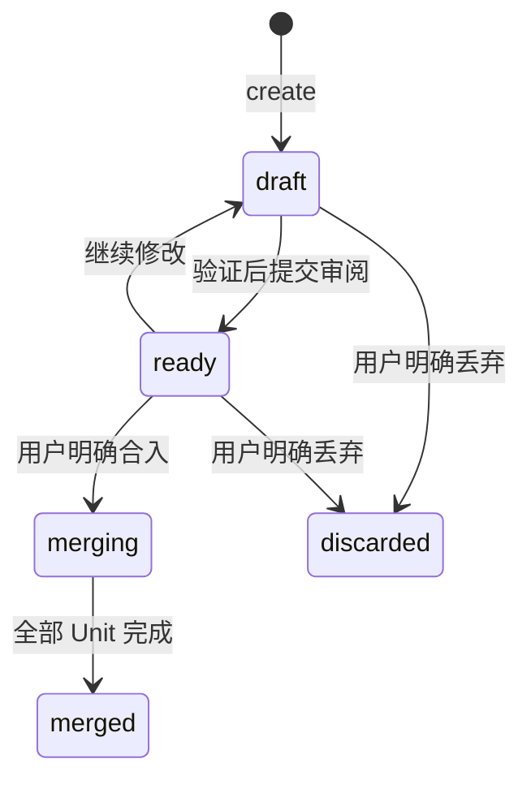

# workbuddy-univer-office — 产品与技术规格

版本：0.6，产品与技术规格草案。更新日期：2026-09-10。

本次需求：参考 `dsh-univer-office` 的用户交互，使用附件列出的 Office SDK 构建 `workbuddy-univer-office`。本文件是可供评审和拆分开发任务的 spec；编写规格不代表授权发布插件或向外部仓库提交 Issue。

### 规格速览

- **用户体验**：自然语言创建或修改 → 实时预览 → 提交审阅 → 查看差异、继续修改、合入或丢弃 → 导出。参考 DSH 的可观察交互，不要求内部协议或代码兼容。
- **内容范围**：Sheet、Doc、Slide、Base、Board，以及同文件跨 Unit 公式与嵌入；详细功能白名单见第 4 节。
- **实现基础**：附件所指的 Runtime、Collaboration、CLI SDK；WorkBuddy 的工具入口、任务上下文、卡片及审批由应用适配。附件是文档索引，不能当成可直接安装的单一 `office-sdk` 包。
- **开发顺序**：先验证 WorkBuddy 中的完整 Sheet 链路和 SDK 版本，再补齐五类内容、完整审阅交互和正式分发，见第 13 节。
- **完成定义**：以第 13.1 节的 25 条验收标准为准；原型、截图或单个工具成功不等于插件全量交付。

本次规格整理不新增应用功能。第 2 节及实施验证记录属于已有工程证据；第 4–13 节中的未完成要求仍是待实施合同。

本规格定义最终范围，不代表功能已全部完成。已有本地开发原型；WorkBuddy 已验证工具调用、卡片挂载、原生全屏，以及 Sheet、Doc、Slide、Base、Board 的基础内嵌实时同步和 ready 状态展示。完整客户端联调、内容能力与只读交互一致性仍未完成。实测与缺口见 [实施验证记录](./workbuddy-univer-office-validation.md)。

## 1. 目标与已确定决策

为 WorkBuddy 用户提供自然语言驱动的 Office 创作、编辑、验证与审阅。用户能看到 Agent 的编辑结果，在同一任务中提出修改，通过明确操作将草稿合入当前版本或丢弃，最后导出标准 Office 文件。

确定以下实现边界：

1. 产品名、插件 ID 和运行包名称为 `workbuddy-univer-office`。
2. `dsh-univer-office` **只作为功能与交互参照**。不依赖该 npm 包，不复制其 Host、Gateway、Worker、Viewer 或存储实现，不引入 DSH/Cordis 适配层。
3. 直接组合附件指定的 **Univer Runtime SDK、Collaboration SDK、CLI SDK**，通过公开 API 构建 WorkBuddy 应用。
4. 拟使用 WorkBuddy 插件/连接器承载 Skills 与本地 MCP 工具；优先验证 MCP App 能否承载实时 Viewer 和审阅交互。此项是技术方案，具体桌面支持版本、展示模式和可信任务上下文由 M0 实测确定，不视为用户已指定或宿主已支持。
5. 默认本地运行：文件留在用户工作区；不引入账号系统、远程 SaaS、组织管理或云存储。
6. 最终范围保留五类内容及完整审阅能力。阶段一验证完整链路，后续阶段补齐覆盖，不以演示版本代替最终交付。

用户纠正后的本规格优先于此前调研中的 DSH 源码移植建议。

### 1.1 需求、方案与待验证项

| 分类 | 内容 | 如何处理 |
|---|---|---|
| 用户明确要求 | 产品名、DSH 交互参照、直接使用附件 Office SDK、功能对齐 | 作为最终范围，不由实施便利性缩减 |
| 本规格建议 | 本地优先、MCP + Skills、官方 SQLite Adapter、受控单 Worker | 在实施中按证据校验；变更时记录原因和用户体验影响 |
| 宿主待验证 | 实时内嵌编辑、浮窗、卡片持久化、可信任务隔离和审批来源 | M0 在实际 WorkBuddy 客户端验证；浏览器测试不替代宿主验收 |
| SDK 待验证 | 精确版本组合、历史恢复、Base 视图导出、跨 Unit 完整渲染 | 以安装版本公开合同和可重复 fixture 为准 |

“功能对齐”以第 4 节 C01–C07、U01–U14 和第 13.1 节验收条件为基线，不自动追随参考仓库未来新增功能。开发原型的完成情况单独记录，不能反向修改验收要求。

## 2. 当前状态与证据

规格起草时仓库只有调研文档。实施阶段已新增 TypeScript 应用源码、精确依赖及 lockfile、分开的服务/Viewer/Render 构建脚本和集成测试；仍没有 Git remote。已读取附件文档索引，并核对相关官方文档、SDK 根 README、关键包 README，以及 CLI `04-worktree` 示例的 Server、CLI、Web、Render Page、配置和数据流。

| 资料 | 本次读取基线 | 用途 |
|---|---|---|
| DSH 交互参考 | `f3a8845dd4c863072b0ae555cdb6a58076c165e7` | 功能与交互验收参照 |
| CLI examples | `bfbb4c7af3fc4d450ff8cc59e2380275643fcc39` | `04-worktree` 的完整组装；其应用依赖为 beta.2 |
| Collaboration examples | `2ef0091528f3a8cbae8802590c2001ad491e564f` | 已获取，实施前按模块读完对应示例 |
| CLI SDK | `632e88d25f10c9c8e246405faef542ff52aeaaa2` | 包职责、公开 API、生命周期 |
| Collaboration SDK | `a7ea9f9b81c59fbf496c331e7eb89b758d95f73a` | 协作、草稿、历史与 SQLite 合同 |

以上是文档/源码证据，不是运行测试。示例中的固定用户 ID、简化错误处理、直接主线创建和内存票据不能原样作为产品策略。

### 2.1 版本选择与发布差异

官方 requirements 文档标注 `1.0.0-beta.2`，要求应用内 SDK 使用匹配的精确发布版本。但本次公共 npm 查询发现：

- `@univer-cli/univer-collaboration-runtime@1.0.0-beta.2`、Worktree Service/SQLite Adapter、Exchange Node 等存在。
- `@univer-cli/unit-pdf-printer@1.0.0-beta.2` 与 `@univerjs-pro/edit-history@1.0.0-beta.2` 返回 HTTP 404。
- Insiders registry 的 PDF 包公布 `1.0.0-insiders.20260907-70fc579`，不含 beta.2。

进一步读取 Insiders registry 的完整包元数据后，已确认本次抽查的 25 个 CLI/Collaboration/History/Exchange 包均包含 `1.0.0-insiders.20260907-70fc579`；Exchange 对应 binding 为 `0.1.1`。见 [SDK 发布证据](./office-sdk-release-evidence.json)。最初证据验证的是发布元数据存在性。实施阶段已成功安装并构建当前所需依赖；实际运行覆盖范围见实施验证记录。

因此，**beta.2 不是已验证可覆盖全部功能的安装基线**。M0 优先验证 `1.0.0-insiders.20260907-70fc579` 这一完整 cohort；只有相关 Runtime、Collaboration、CLI、History、PDF 包及 native 依赖均验证后，才生成最终 lockfile。不能混装 beta.2 与 Insiders，也不能为了补包转用 DSH 构建产物。

native binding 与资源包可能采用独立版本号，应使用所选 SDK manifest 的精确约束。例如 beta.2 示例的 Exchange binding 是 `0.1.0`，不应机械改写成 SDK cohort 版本。

实施时以最终安装产物的类型、exports 和 README 为准；仓库 main 的接口仅作为查证线索。

## 3. 用户流程

### 3.1 从一句话创建内容

用户输入“制作一张销售分析表，包含公式和图表”。Agent 创建 Office 文件及独立草稿，在草稿中新建 Sheet，编辑、提交、回读和截图验证。第一次可展示内容出现后，预览自动打开并持续更新。完成后进入“待审阅”，卡片留在对话里。

### 3.2 修改已有文件

用户选择 XLSX、DOCX、PPTX、CSV、TSV 或本插件创建的 Office 文件。插件明确显示目标文件、草稿和 Unit。标准 Office 来源导入草稿；源文件在用户选择输出位置前不被覆盖。修改和检查都指向同一草稿版本。

### 3.3 用户审阅与继续修改

用户切换“查看 / 对比”，检查内容与差异，选择“合入当前版本”“继续修改”或“丢弃草稿”。继续修改使 ready 回到 draft，Agent 沿用该草稿。合入成功后显示主线；丢弃后主线不变。

### 3.4 查看历史与导出

用户可重开旧回合卡片、查看主线版本历史，并显式恢复某个历史版本。导出按钮显示文件类型和输出位置。主线支持 Ribbon 导入/导出；草稿审阅 Ribbon 不开放该入口。Agent 显式导出草稿时必须标记“草稿导出”，不会隐式合入。

### 3.5 多 Unit 与部分合并

同一 Office 文件可包含 Sheet、Doc、Slide、Base、Board，并有跨 Unit 公式和嵌入。一次草稿可修改多个 Unit。若其中一个 Unit 合并失败，界面逐项显示已合并、冲突或未完成，不能显示“全部成功”，也不能声称已自动回滚其他 Unit。

## 4. 功能范围

### 4.1 内容矩阵

| ID | 类型 | 创建与编辑 | 检查/交付 |
|---|---|---|---|
| C01 | Sheet | 值、公式、样式、表格、图表、透视表、筛选、数据校验、条件格式、迷你图、图片 | 范围/结构检查、公式结果、截图、PDF；XLSX/CSV/TSV 导入导出 |
| C02 | Doc | 段落、富文本、列表、任务、表格、图片、图表、页眉页脚、分页、页面布局 | 结构回读、分页截图、PDF；DOCX 导入导出 |
| C03 | Slide | 页面、文本、形状、图片、表格、图表、转场、SVG 编译 | 结构、布局 lint、逐页截图、联系表、PDF；PPTX 导入导出 |
| C04 | Base | 表、字段、记录、视图、公式、排序、筛选、分组、Sheet 引用 | 概览、针对记录的只读查询、工作台截图；XLSX/CSV/TSV 导出 |
| C05 | Board | 形状、文本、图片、连接线、原生图表、连接线路由 | 概览、元素检查、区域/元素截图、PDF |
| C06 | 混合文件 | 多 Unit、同文件公式引用、内容嵌入 | 编辑、截图、打印和导出均正确装配引用数据与图片 |
| C07 | 资源/API | 离线 API 搜索与详情；图标、Logo、Emoji、插画 | 精确版本 API、registry 查询、资源读取/导出、缓存 |

Base 概览不含完整记录值；记录读取用 SDK 支持的只读 Facade 查询补充。Base 表格导出定义为“当前选择的表或视图”，保留可见字段顺序、过滤与排序，不导出隐藏字段。Exchange 的直接导出能力不等于符合该视图合同，必要时使用 SDK 数据投影。当前文本/数值及部分同表公式的验证证据见实施验证记录；不能据此推定日期、附件、关联字段或跨 Unit 公式通过验收。

当前范围不含 Base PDF、Board 独立文件导出、Slide 母版/版式页/演讲备注，以及 DSH 未开放的 Board 思维导图、墨迹和高级表格能力。SDK 可支持的其他旧版 Office 输入格式不自动扩大本期格式白名单。

### 4.2 交互矩阵

| ID | 交互 | 验收行为 |
|---|---|---|
| U01 | 实时预览 | 有内容时显示，已确认变更实时更新；纯读取不主动弹出 |
| U02 | 浮窗 | 拖动、缩放、折叠、最大化；用户关闭后当前编辑轮次不反复弹出 |
| U03 | 对话审阅卡片 | 一个文件/草稿在同回合去重；旧回合保留完整卡片并默认折叠 |
| U04 | 全屏 | 与卡片使用同一目标，退出后保留位置和选中 Unit |
| U05 | Unit 导航 | 草稿导航优先列出改动 Unit；空文件有明确空状态 |
| U06 | 生命周期 | draft、ready、merging、merged、discarded 状态与按钮一致 |
| U07 | 对比 | 草稿对 trunk 或同文件另一活跃草稿，五类 Unit 双栏语义差异与定位 |
| U08 | 固定版本 | 对比打开时固定两侧版本；后续变化提示“有更新”，显式刷新才替换 |
| U09 | 历史 | 五类 Unit 主线历史查看；可编辑视图允许显式恢复，只读不允许 |
| U10 | 终态 | 合入/丢弃后关闭实时浮窗，旧卡片保留状态且显示主线 |
| U11 | 删除/不可用 | 文件消失后不展示仍可操作的预览；可显示不可用占位，宿主允许时移除卡片 |
| U12 | 隔离与恢复 | 不同任务不串目标；重启可恢复草稿、卡片和历史 |
| U13 | 偏好与语言 | 中英文、深浅主题；关闭自动浮窗不影响审阅卡片 |
| U14 | 文件操作 | 主线 Ribbon 导入/导出、受支持类型打印、产物路径与错误反馈 |

语义对齐不要求 DSH 的 DOM、CSS、像素尺寸、内部工具事件或浮窗组件结构相同。若 WorkBuddy 当前版本缺少某个宿主界面能力，该行标记为“宿主待支持”，不能用普通链接替代后宣称全量完成。

## 5. SDK 组装与职责



Node Transport 承接 HTTP/WebSocket；Endpoint 管协议、票据、房间；Service 管 Unit、OT、revision；SQLite Adapter 管原子持久化与提交幂等。应用只实现业务文件、任务、权限、展示与编排，不重新实现 OT、ACK 或协作存储。

### 5.1 选用包

下列为直接功能依赖；具体 peerDependencies 和前端功能插件由所选版本的 manifest 及 Runtime 官方文档补齐。

| 层 | SDK 包 | 责任 |
|---|---|---|
| 协作核心 | `@univerjs-pro/collaboration-service`、`collaboration-endpoint`、`collaboration-transport-node`、`collaboration-database-sqlite` | authoritative Unit、HTTP/WS、持久化 |
| 草稿 | 同 scope 的 `collaboration-worktree-service`、`-endpoint`、`-client`、`-database-sqlite` | 隔离编辑、ready、预览评估、合并、丢弃 |
| 历史 | 同 scope 的 `collaboration-history-service`、`-endpoint`、`-database-sqlite`，对应 Runtime History UI | 历史索引、查看与恢复 |
| 前端 | Runtime SDK 五类内容/UI/Facade、Collaboration Client/UI、需要的图表/公式/嵌入/打印插件 | 用户编辑、预览与比较视图 |
| Agent runtime | `@univer-cli/headless-univer`、`univer-collaboration-runtime` | 显式加载一个 Unit、同步、执行、提交、释放 |
| Agent 内容 | 同 scope 的 `content-inspection`、`content-execution`、`api-reference` | 稳定读取、Facade 程序绑定、API 检索 |
| 视觉 | 同 scope 的 `univer-render-page`、`univer-render-runtime`、`unit-screenshot`、`unit-layout-lint`、`unit-pdf-printer` | 页面组装、浏览器生命周期、图像/PDF/检查 |
| 创作资源 | 同 scope 的 `svg-facade`、`resource-library` | SVG 编译、素材查找与缓存 |
| Office 格式 | `@univerjs-pro/exchange-node` 及其指定 binding | `importFile()` / `exportToFile()` |

工具直接调用基础 TypeScript API，无需 Commander `*-command` 包或全局 `univer` CLI。当前不增加 runtime pool 或 daemon SDK；只有测得短生命周期加载成本无法达标时再单独设计复用。

### 5.2 已核对的 SDK 调用合同

- `createStandardHeadlessUniverFactory()` → `createUniverCollaborationRuntimeFactory()` → `load()`。
- `createWorktreeCollaborationConfig()` 负责草稿协议地址映射；trunk 与 worktree 使用不同目标。
- `inspectContent()` 接收只读 runtime；`prepareContentExecutionProgram()` 只生成绑定 Unit 的程序。
- `runtime.execute({mode, code})` 成功不代表提交成功；写入后必须检查 `runtime.commit()`。
- `runtime.pull()` 与 `runtime.exportUnitData()` 提供已选版本的完整内容，交给视觉或 Exchange。
- `createUnitScreenshot().capture()`、`createUnitPdfPrinter().print()` 返回 bytes，应用负责保存。
- `compileSvgToFacade()` / `wrapSlideScript()` 生成页面程序，之后仍需 execute 和 commit。
- Worktree Client 提供 `markReady()`、`reopenWorktree()`、`mergeWorktree()` 等；对应 Service 负责最终状态。

这些名称来自本次读取的 SDK 文档。实施前必须对选定安装版本类型检查；本规格中的应用接口不冒充 SDK API。

## 6. 文件与持久化

### 6.1 Office 文件

默认一个工作区内 `.univer` 文件是一个应用容器，允许多 Unit。采用官方 Core/Worktree/History SQLite Adapter 共享该物理文件，并加入 `wb_office_*` 应用表。应用通过 SDK Service 修改协作内容，不直接写 SDK 表。

这是本应用格式，必须保存 `formatId = workbuddy-univer-office` 与 `schemaVersion`。**不把“SQLite + .univer 后缀”当作与 DSH/univer-cli 文件兼容的证据。** 本期不承诺 DSH 内部 `.univer` 文件的二进制兼容；遇到未知格式应拒绝写入并提示导入标准 Office 文件。若后续需要互通，另定迁移合同。

### 6.2 应用数据

| 数据 | 持久位置 | 必须保存 |
|---|---|---|
| 文件身份 | Office 文件内 | formatId、schemaVersion、fileId、名称、创建时间 |
| Unit 目录 | Office 文件内 | unitId、kind、名称、显示顺序、是否已移出主线目录 |
| Worktree 目录 | Office 文件内 | worktreeId、名称、关联 taskId、创建时间；SDK 状态按需重读 |
| 图片与嵌入资源 | Office 文件内 | assetId、MIME、hash、bytes；资源引用稳定且可解析 |
| 审阅意图/操作结果 | Office 文件内 | operationId、actor、目标版本、动作、每 Unit 结果、恢复状态 |
| 卡片索引 | 插件持久目录 | taskId、turnId、fileId、worktreeId、卡片 key、用户显示偏好 |
| 缓存 | 插件持久目录 | 可重建的资源缓存、下载/浏览器缓存与版本 |

权威内容、草稿状态和 mergeResult 来自 SDK。应用目录是业务数据/可恢复投影，不把进程内 Event 当成唯一可靠存储。业务动作先持久化 operation intent；SDK 完成后记录结果；重启根据 SDK 当前状态补齐未完成投影。

复制文件前由应用完成 checkpoint/一致性备份；不直接复制仍在写入且存在未归档 journal/WAL 的 SQLite 主文件。打开相同 realpath 时复用同一个应用 FileContext；同 fileId 的不同物理副本不自动合并。

### 6.3 Unit 删除

SDK `setUnitRemoved()` 表示“不合并该 Unit 的草稿内容”，不删除已有 trunk Unit。本应用将“从文件移除 Unit”实现为草稿内删除意图，用户合入后更新文件目录，并保留可恢复内容；新建后又删除的草稿 Unit 不进入主线。不能直接把 `setUnitRemoved()` 的成功解释成主线文件已删除。

## 7. 应用接口合同

以下是本项目自定义合同。对外字段采用 `unitId/worktreeId`，SDK 边界映射为实际 `unitID/worktreeID`，不要在各工具中分别拼接 URL。

```ts
type UnitKind = 'sheet' | 'doc' | 'slide' | 'base' | 'board';
type OfficeTarget =
  | { fileId: string; unitId: string; branch: 'trunk' }
  | { fileId: string; unitId: string; branch: 'worktree'; worktreeId: string };

interface RevisionRef {
  unitId: string;
  revision: number;
}

interface ReviewRef {
  fileId: string;
  worktreeId: string;
  readyRevisions: RevisionRef[];
  directoryRevision: number;
}

interface OperationResult<T> {
  schemaVersion: 1;
  operationId: string;
  outcome: 'completed' | 'partial' | 'pending-review' | 'unknown';
  target?: OfficeTarget;
  revision?: number;
  value: T;
  warnings: { code: string; message: string }[];
  review?: ReviewRef;
  artifactIds?: string[];
}

interface OfficeError {
  code: string;
  message: string;
  retryable: boolean;
  recovery: 'retry-same-operation' | 'reopen' | 'refresh' | 'review' | 'none';
  operationId: string;
}
```

一次多 Unit 操作返回逐 Unit result/revision，不创造一个虚假的“全文件 SDK revision”。`directoryRevision` 仅为应用目录版本。MCP 错误使用 `isError: true` 与可读文本，结构化内容保留稳定错误码；“unknown”表示尚不能确认提交结果，不能当作安全重跑。

### 7.1 模型工具

保留 14 个清晰领域工具作为本应用命名选择，方便和交互参照逐项验收，不要求 DSH 参数/结果协议兼容。

| 工具 | 主要入参 | 行为 |
|---|---|---|
| `univer_new` | `file` | 创建空容器，返回 fileId；目标已存在则报错 |
| `univer_status` | `fileId`，可选 `worktreeId` | 返回 Unit 目录、SDK 状态、逐 Unit revision 与可用动作 |
| `univer_worktree` | `fileId, action`；create 可选 unitIds；其他动作含 worktreeId | create/ready/reopen；merge/discard 进入具体用户审阅授权流程 |
| `univer_unit` | `fileId, worktreeId, action`；create 含 kind/name，remove 含 unitId | 草稿内创建或标记移除 |
| `univer_import` | `fileId, worktreeId, source, name?` | 导入为草稿 Unit，校验文件类型，保留源文件 |
| `univer_inspect` | `target, query` | SDK query discriminated union，Base 记录另走只读 execute |
| `univer_execute` | `target, mode, code/codeFile` | 代码来源二选一；write 只允许 draft，read 可读主线或草稿 |
| `univer_export` | `target, output`，Base 含 table/view 选择 | 导出选定已确认版本；扩展名与类型必须匹配 |
| `univer_lint` | `target, pages?` | 仅 Slide，返回规则、证据、coverage |
| `univer_compile_svg` | `target, source, page, mode` | 仅 draft Slide，mode 为 append/replace；编译诊断随结果返回 |
| `univer_screenshot` | `target, selector?, output?` | 五类内容 PNG；提供模型可见图像与持久 artifact |
| `univer_print_pdf` | `target, output` | Sheet/Doc/Slide/Board PDF |
| `univer_api` | `action: find/show, queries/symbols, unit?, limit?` | 本地精确版本 API 查询 |
| `univer_resources` | `action, queries/handles, registries?, output?` | list/find/read/export；素材下载缓存 |

14 个领域工具的公共 schema 计划集中管理；当前原型注册入口为 `src/mcp/main.ts`。允许为宿主展示增加 `univer_preview` 等辅助工具，不将工具数量等同于功能完成度。由启动时的 SDK capability 检查验证支持性；依赖未就绪不能注册一个假成功工具。最终版本需要全部通过，PoC 的缺失工具必须明确标注。

额外的界面状态、审阅、比较、历史请求属于 MCP App 资源/应用 API，不为凑齐工具数量暴露给模型。Viewer 读取走无副作用接口；按钮写入走宿主工具桥或等价可信用户通道。

## 8. 写入、审批与恢复规则

### 8.1 Agent 写入

固定执行顺序：解析可信任务 scope → 解析 target → load → pull → prepare/execute → commit → 检查状态 → 回读 → 返回结果 → close。

- read 模式禁止 mutation，且不调用 commit。
- write 模式只能写 draft；ready、merging、merged、discarded 一律拒绝。
- `confirmed` 和 `nothing-to-commit` 可完成；无 mutation 不制造 revision。
- `pull-required` 在同一 runtime pull 后再 commit；最多两次额外提交尝试，仍不确定则保留恢复信息。
- `retry/unknown` 只能沿同一逻辑提交身份恢复，禁止重新执行含“追加行”等语义的原始程序。
- 取消发生在提交前则终止本地工作；提交后仍报告实际确认结果；网络断开导致结果未知则返回 unknown。
- 写入同一 `(file, branch, worktree, unit)` 串行。浏览器编辑的并发由 SDK OT 处理，应用不自行覆盖快照。

### 8.2 Ready 与审阅



ready 固定逐 Unit revision，并将检验报告关联到该版本；检查后又有修改则旧报告标记过期。Slide 每个修改页都要 lint 和截图；其他类型按变更范围结构回读及必要截图。存在 lint finding 可说明原因，但不能伪称零问题。

merge/discard 必须绑定具体 file、worktree 和版本。通用“允许使用 MCP”或模型输入 `approved: true` 不构成内容审批。用户点击 Viewer 按钮可形成明确审批；用户在对话中明确要求时，由 HostAdapter 校验宿主可验证的授权。无法获得可信授权时返回 pending-review 并给出审阅入口。

合并前重新检查 readyRevisions、目录版本和 trunk heads。若用户看到的比较已过期，刷新评估并提示再次审阅；实际合并仍以 SDK 当前 trunk 执行。不要将只读 merge preview 当作合并授权。

### 8.3 部分合并与删除完成

SDK 逐 Unit 合并，应用展示原始 mergeResult 的业务含义：成功、已合并、移除、冲突、未完成。不得保证跨 Unit 原子回滚。重试从既有操作与 SDK 结果继续，不重复已成功的 Unit。

目录移除或新 Unit 目录登记可能在 SDK 内容操作之后完成。此时返回 partial，保留同 operationId，重启后补齐目录投影；全部内容和目录完成后才显示“已合入”。

### 8.4 权限边界

本地服务建立用户与 Agent 的独立 principal。任务、工作区来自可信宿主信息；仅由模型提供的 taskId、文件路径或 MCP 连接 ID 不能取代授权。HTTP、WebSocket、Core、Worktree、History 分别接入同一应用授权策略。

Viewer URL/资源只携带受限目标或短期票据，不允许浏览器自行指定任意绝对路径。所有输入/输出使用 realpath 校验。Facade 程序绑定不是操作系统沙箱；内容执行与渲染的进程隔离、文件/网络权限必须在发布前验证。

## 9. Viewer、比较与历史

### 9.1 布局

统一 header 显示文件名、草稿名与状态；中间为查看/对比切换；操作区包含继续修改、合入、丢弃。窄窗口按语义顺序换行，不遮挡状态。主体是 Runtime SDK 编辑器，附 Unit 导航。

同一视图组件用于卡片、浮窗和全屏。并排比较时只保留左右两个活动编辑器实例；切换 Unit 释放旧实例，避免为每个历史卡片常驻完整 Runtime。

### 9.2 固定语义比较

Worktree merge evaluation 只用于 ready 的合并评估，**不是通用五类型双栏 diff 服务**。应用另建 ComparisonService：从已确认 revision 物化左右 UnitData，使用所选 SDK 公开 History/内容 API 生成语义变化，再映射到差异导航。

ComparisonSession 保存 comparisonId、两侧 branch/worktree、逐 Unit revision、目录版本与创建时间；内容及图片解析固定到这组输入。刷新创建新 session，旧 session 不跟随 live head 漂移。

最低语义粒度：Sheet 单元格/范围/公式/样式/表格与图表；Doc 段落/文本/表格和绘图；Slide 页面/元素；Base 表/字段/记录/视图；Board 元素/连接线。列表条目必须能定位内容，原始 JSON diff 不算完成。只支持当前 SDK 的公开差异 API，缺失能力在 M0/M3 记录并解决，不复制 DSH 比较组件补洞。

差异导航的验收合同：

| 内容 | 点击变化后的可观察结果 |
|---|---|
| Sheet | 激活对应工作表，滚动并选中目标单元格或范围；非单元格实体提供对应位置 |
| Doc | 滚动至对应段落、文本范围或表格/绘图，并显示可辨认的选区或标记 |
| Slide | 激活对应页面并标记目标元素；只切换到页面不能算元素定位完成 |
| Base | 激活对应表/视图，将目标字段、记录或单元格滚动至可见区域并选中 |
| Board | 将目标元素或连接线移入可见区域，并提供可辨认的选中标记和缩放操作 |

新增内容在左侧、删除内容在右侧可能不存在，分别明确显示“此版本中不存在”。过滤隐藏、实体不支持和加载失败应独立说明，不能统一显示定位成功。两侧加载完成后才开放导航；快速连续选择时，仅最新请求的结果可更新状态。只读快照保留滚动、缩放和选择能力，但编辑、粘贴、删除、增行等行为不能改变内容。自动化验收需比较导航前后的完整内容及 revision；API 返回成功和空白画布不构成视觉验收证据。

### 9.3 历史

History Service 的索引是派生数据，Core 确认 changeset 才是事实。启动或发现索引缺口时按已确认历史补齐，再显示历史完整状态。恢复历史生成新主线变更，不能把旧 snapshot 直接覆盖数据库。

恢复须先展示目标 Unit、当前 revision 和所选历史 revision，再由用户确认。准备阶段固定这组版本；主线已更新时要求重新审阅。每次恢复使用稳定 operationId，重试及服务重启不得重复生成恢复版本。用户取消尚未提交的恢复后，服务端持久记录取消状态，原 operationId 不得再次确认；重复取消应返回同一结果。已经提交的操作不能宣称取消成功，应查询或重试同一操作以确定结果。只关闭弹窗不算持久取消完成。上述行为必须分别验证内容、revision 和操作记录，包含取消后重启场景。

应用切换或关闭视图时释放 SDK 订阅、Univer 实例和 WorktreeEventClient；断线重连先重新读取完整状态。卡片恢复依赖稳定 fileId/worktreeId 与本地索引，重新申请 Viewer 地址，不持久化临时端口为唯一入口。

## 10. 资源、公式、渲染和导出

截图/PDF/布局检查先确定 target 和已确认 revision，再装配主 UnitData、公式引用 Unit、嵌入 Unit 和图片 bytes。引用 Unit 用同一分支内目标优先，主线只作为显式允许的引用；循环和不可解析引用给出具体错误，不能静默换成别的文件。

Render Page 是机器检查入口，Viewer 是用户交互入口，分别构建。两者注册相同的必需内容/图表/公式/嵌入能力，使用相同 SDK cohort。`formulaReferenceUnits` 和 `resolveImage` 采用安装版本公开合同。

截图返回 PNG ImageContent 和 artifactId；MCP 宿主无法向当前模型交付图像时说明检查未完成，保留可打开产物。PDF/Office 先写临时文件再原子发布；失败时不留下伪成功文件，也不覆盖已有交付物。覆盖已有输出只在明确授权后执行。

公式校验必须包含计算完成后的结果。标准 headless factory 的默认初始计算设置不代表已经完成重算，应按目标 SDK 的 Facade/执行合同等待并验证。

### 10.1 Base 表与视图导出合同

`univer_export` 对 Base 要求显式传入 `baseSelection: { tableId, viewId? }`。只给 `tableId` 表示导出该表的非系统字段与全部记录；同时给 `viewId` 表示导出该视图的可见字段及投影记录。界面从当前选择传入 ID，工具调用不得猜测第一个表或视图。不存在的 ID、视图不属于该表、非 Base 传入此参数时返回明确错误。

安装版本 `1.0.0-insiders.20260907-70fc579` 的 Exchange 公共类型确认支持 `IBaseSnapshot` 直接导出 XLSX/CSV/TSV；CSV/TSV 选择器含 `tableId` / `tableName`，但没有 `viewId`。因此不能将原始 Base 全量 snapshot 交给 Exchange 后假定视图筛选已生效。Base Facade 的 `getViewById()`、`getProjection()`、`getVisibleFields()` 提供视图读取入口；具体字段类型、公式结果与资源的转换仍须 fixture 验证。

实现必须从同一个已加载 Runtime 的同一确认版本读取 snapshot 和视图投影，导出期间检测版本是否变化；无法保证一致性时重取读取结果，不重新执行写入。输出返回 `target`、`revision`、实际 table/view ID、字段顺序、记录数和产物路径。导出所用投影只存在于交付流程，不能写回原 Base，也不能改变 draft/ready 状态。

最低测试包含两个表、一个隐藏字段、不同于表顺序的视图字段顺序、筛除一条记录、降序排列和空结果视图；分别检查 XLSX/CSV/TSV 的表头、行顺序、记录值及未泄露其他表/隐藏字段。公式使用已确认的计算结果；日期、选择项、关联与附件等字段在转换语义核验前明确报告限制，不能静默丢弃。此节是完整实施合同；当前基础表/视图导出已有实现和测试，仍不能据此宣称所有 Base 字段类型通过验收。

## 11. 运行、安装与配置

产品由一个发布包维护源码与运行产物，包含本地服务、MCP 入口、Viewer、Render Page、Skills。插件包装与连接器包装是同一运行包的备选分发入口，最终以 M0 证明支持 MCP App 的路径为默认；避免同时启用造成重复工具。

WorkBuddy 5.5.4 的开发接入已实测：自定义 stdio 工具可调用，但不在该版本 MCP App 发现来源内；带独立随机凭据的 loopback Streamable HTTP 连接器可发现并挂载 Office 卡片。当前默认开发路径因此采用本机 HTTP，共享同一个 Office Runtime，保留 stdio 工具入口用于其他兼容场景。早期卡片使用已确认版本的截图；后续已验证五类内容的 Runtime 只读实时内嵌预览、原生全屏及 ready 状态更新，刷新经宿主工具桥执行。编辑与审阅入口仍打开浏览器 Viewer。上述基础 fixture 不代表完整审阅、浮窗、任务权限隔离或正式插件安装通过；最终交互范围保持第 4 节要求，差距继续按实施验证记录验收。正式安装应自动管理本机服务和凭据更新，不能要求普通用户手工配置开发进程。

初始运行上限：一个安装实例的共享本地服务；一个内容 Worker；一个 Render Runtime 浏览器会话。不同任务可复用服务但独立授权。其他请求排队并支持取消。SDK 浏览器自身的 renderer/GPU 子进程不计为多个服务实例。

服务仅监听 loopback；默认尝试 9080，端口占用时递增。用服务身份和随机启动凭证区分本插件实例，不连接任意同端口服务。任务结束释放任务租约；所有任务和 Viewer 断开且空闲 60 秒后关闭自有服务及 Worker。退出时先停止接入，再关闭 Runtime/Transport/Service/Adapters，避免锁未释放。

| 配置 | 初始默认值/约束 |
|---|---|
| Node | 至少 22.12；最终取 SDK/native/构建工具要求的最高下限 |
| serviceStartupTimeoutMs | 10,000 |
| operationTimeoutMs | 120,000；连接超时与工具执行超时分别配置并验证 |
| autoOpenLivePreview | true |
| maxContentWorkers | 1 |
| maxRenderSessions | 1 |
| screenshotMaxPages | 30 |
| screenshotMaxPixels | 单图 16,777,216；每批总像素上限 67,108,864，超出则拆批或返回限制错误 |
| browserExecutablePath | 显式配置优先，支持 UNIVER_RENDER_BROWSER |
| locale/theme | 跟随宿主；无宿主值则使用系统语言与主题 |
| license | 运行配置注入；不从 DSH 获取，不硬编码到源码 |

浏览器不存在时提供明确诊断及安装入口；运行一次截图不应隐式反复下载浏览器。素材 registry 下载可能联网，其余本地文件编辑不要求上传云端。

主开发环境以本机 macOS 为首测，发布前还验证 Windows x64 和 Linux x64；这三个环境的 native 包、文件锁和进程退出都必须实测。macOS Intel/ARM 按发布包宣称的架构分别验收，不能只复制开发机 node_modules。

## 12. 实施目录

下面是目标目录划分；现有原型已包含其中部分目录，未出现的目录仍是规划。

```text
.workbuddy-plugin/plugin.json    # 内联插件 MCP 配置，避免被当作项目配置加载
packaging/connector/             # 可选分发包装
src/
  host/                         # WorkBuddy scope、展示能力、审批桥
  mcp/                          # MCP 注册、14 个工具、App 资源
  application/                  # 文件、目标、工具编排、审阅、权限
  server/                       # 官方 Transport/Endpoints/Services 组装
  storage/                      # 应用表、SDK Adapter 组装、备份/恢复
  worker/                       # CLI SDK 内容执行入口
  viewer/                       # Runtime UI、审阅、历史、比较
  render-page/                  # 机器渲染静态入口
  shared/                       # 纯数据合同与错误码
skills/
  univer/ univer-sheet/ univer-doc/ univer-slide/
  univer-base/ univer-board/ univer-embed/ univer-cross-unit-formula/
tests/
  contracts/ integration/ e2e/ fixtures/
scripts/                        # 分目标构建、打包、版本一致性检查
docs/
  workbuddy-univer-office-spec.md
  sdk-compatibility.md           # M0 产物：依赖/宿主/平台能力证据
```

不创建 Git submodule。参考 SDK/examples checkout 保留本地。后续 PR 使用英文，并遵守届时项目 `.github` 下的模板。

## 13. 里程碑与测试

| 阶段 | 优先级 | 交付与完成门槛 |
|---|---|---|
| M0 接入合同验证 | P0 | 精确 SDK cohort 安装/typecheck；WorkBuddy 包发现；真实 Sheet 编辑→commit→实时预览→ready→用户合入→重启恢复；MCP 图像回读；可信 scope；PDF、语义 diff、Unit 删除 API 核验 |
| M1 数据与工具基础 | P0 | 官方持久化组装、自有容器/授权/操作恢复、14 工具合同、基本五类 Unit 创建读取 |
| M2 完整内容能力 | P1 | C01–C07，格式交换、资源、视觉检查与跨 Unit 引用 |
| M3 完整交互 | P1 | U01–U14，固定比较、历史、部分合并、卡片/会话恢复、语言和设置 |
| M4 分发与稳定性 | P1 | 干净环境安装、升级/卸载、三平台验证、错误恢复、使用文档 |

依赖：M0 → M1 → M2/M3 → M4。先验证 SDK 与宿主边界，避免围绕无法加载的包或不存在的宿主接口实现完整 UI。M2/M3 是工作划分，不要求并发启动服务或 Agent。

工期暂不承诺：SDK 安装及 WorkBuddy 基础接入已有实测，但 M0 的可信任务隔离、完整审阅和重启恢复等门槛尚未全部通过。M0 完成后分别估算基础服务、工具/内容、Viewer/比较、分发测试四部分，依据实际 SDK 缺口和测得的首屏/渲染耗时，而非按文件数估算。

### 13.1 验收标准

1. 运行依赖和产物没有 `dsh-univer-office`、`@deepseek-ai/*` 或 DSH 复制源码；核心能力来自选定 SDK。
2. 所有 SDK 包属于一个经验证 cohort；native 包按 manifest 匹配；干净安装可运行。
3. 创建空文件不覆盖旧文件；五类 Unit 均可创建、回读、编辑；空状态可见。
4. Agent write 不可写 trunk 或非 draft；read 不产生 mutation；重复无变更操作不制造 revision。
5. 每次写入只有确认 commit 后才显示成功；unknown、取消与重试不重复追加行/元素。
6. Sheet fixture 至少包含公式、图表、透视表、条件格式与校验，检查数值并导出 XLSX/CSV/TSV。
7. Doc fixture 包含富文本、表格、图表、页眉页脚，验证分页截图、PDF 与 DOCX。
8. 六页 Slide fixture 使用 SVG 编译并含表格/图表；逐页 lint 与截图，输出可打开 PPTX。
9. Base fixture 的公式/过滤/分组和记录值可核验；导出符合可见视图字段与行顺序。
10. Board fixture 可检查连接线/图表、按元素截图并打印 PDF；不注册不支持的文件导出。
11. 同文件混合 Unit 的公式和嵌入在实时 Viewer、截图与导出中一致；引用缺失有明确错误。
12. ready 固定版本；之后写入被服务端拒绝；reopen 后才可继续。
13. merge/discard 缺具体用户授权时不执行；按钮成功后模型获得可恢复的结构化状态。
14. 多 Unit 合并中人为制造一个冲突，逐项结果正确；重试不重复已完成 Unit，主线不被隐式回滚。
15. Unit 移除经审阅生效；discard 不改变主线目录；应用重启可补齐部分完成的目录投影。
16. 五类 Unit 均有可定位的语义差异；固定对比不会随 live head 漂移，刷新产生新版本对比。
17. 已有 trunk 历史可查并显式恢复；只读视图和草稿不能绕过恢复权限。
18. 两个任务/两个工作区中的同名文件不串目标或卡片；相同物理文件的并发写入不损坏数据库。
19. 卡片、浮窗、全屏切换保持目标；关闭自动浮窗不影响卡片；旧卡片和终态展示正确。
20. 删除文件、失效票据、端口变化、断网/重连与客户端重启不会显示错误目标或假成功。
21. 图片返回被目标 WorkBuddy 模型实际读取；超大截图按预算分批或报错，不无限占用内存。
22. 受控并发不超过配置；停止任务与关闭应用后无遗留自有服务/文件锁。
23. 384px 宽卡片和桌面全屏均能完成审阅；中英文/深浅主题下按钮与状态可读。
24. 支持的导出文件用对应 Office/WPS/兼容应用打开并检查关键内容，不能只验证文件存在。
25. 干净机器完成安装→创作→审阅→导出→重启恢复；更新和卸载不删除用户工作区文件。

性能目标为待测验收预算：本地暖态提交确认后 2 秒内 Viewer 显示更新；暖态重新打开小型 fixture 的预览在 3 秒内完成。每个预算至少测 20 次并报告 P95，记录机器/浏览器/SDK 版本。冷启动和大文件先在 M0 建立基线，再制定限制；本稿不提供伪造性能数据。

### 13.2 测试分层

| 层 | 重点 | 最低 fixture/场景 |
|---|---|---|
| 合同测试 | 工具 schema、target/路径、授权、状态、错误、版本映射 | 14 工具均覆盖成功/无效输入/拒绝或取消；仅适用项 |
| SDK 集成 | SQLite、工作树、提交恢复、资源、Office 交换 | 五类 Unit fixture；一个多 Unit 文件；一个部分合并 fixture |
| Viewer 集成 | 对比、历史、状态、语言、清理 | 每类 Unit 的新增/修改/移除、固定 revision 与 stale |
| WorkBuddy E2E | 实际注册、MCP App、审批、图片回读、任务恢复 | 一个完整 Sheet 链路 + 两任务隔离 + 客户端重启 |
| 打包/平台 | 干净安装、native、浏览器、退出、升级 | 每个宣称支持的 OS/CPU |

开发只构建当前目标，如 server、viewer 或 render-page；验证某个 SDK example 只运行该 example。发布检查也按受控顺序执行，不并发启动全部 demo。

## 14. 发布门槛与回退

以下问题仍需技术验证，不能当作用户已接受的范围削减：

- 完整 SDK cohort 的发布包、公开类型、PDF 与语义差异能力均可用。
- WorkBuddy 具体版本提供可信任务上下文、可用 MCP App 注册路径与审阅/图片接口。
- 自动浮窗、旧卡片折叠/去重/恢复是否需要额外宿主支持。
- 选定版本的五类 Runtime 组合、跨 Unit 引用、Base 导出与历史恢复合同通过 fixture。

任何一项未完成都要在 `sdk-compatibility.md` 标记证据和影响，相关功能不可宣称完成。外部浏览器可作为诊断或手动打开入口，不替代 U01–U14 验收。

上线后出现问题可禁用插件并停止自有服务，工作区文件保留。升级前关闭旧 writer 并做一致性备份；旧版本遇到新 schema 必须拒绝写入，不能盲目降级。草稿可经用户丢弃；已合并变更通过新恢复版本修正，部分合并不假定整体事务回滚。

## 15. 实施前阅读清单与参考

遵守附件要求：应用开发前读完相关文档、最接近的完整 examples，以及每个采用包的 README/安装版本类型。此次规格研究不等于全部开发前置验证已经完成。

- [SDK 总览](https://office.univer.ai/overview/overview)：Runtime/Collaboration/CLI 与应用职责。
- [模块边界](https://office.univer.ai/collaboration/modules)、[身份与授权](https://office.univer.ai/collaboration/identity-and-authorization)、[Database Adapters](https://office.univer.ai/collaboration/database-adapters)。
- [Worktree 流程](https://office.univer.ai/cli/worktree)、[协作扩展](https://office.univer.ai/collaboration/extensions)：ready、逐 Unit merge、独立历史和权限。
- [内容操作](https://office.univer.ai/cli/content-operations)、[文件交换](https://office.univer.ai/cli/file-exchange)、[视觉检查](https://office.univer.ai/cli/visual-inspection)、[版本要求](https://office.univer.ai/requirements)。
- [CLI 04-worktree 示例](https://github.com/dream-num/univer-cli-examples/tree/bfbb4c7af3fc4d450ff8cc59e2380275643fcc39/examples/04-worktree)：完整 Server/CLI/Web/Render 组装参考。
- [Collaboration examples](https://github.com/dream-num/univer-collaboration-examples/tree/2ef0091528f3a8cbae8802590c2001ad491e564f)：实施对应模块前补读 quick-start、permissions、history、worktree、exchange 的完整源码。
- [CLI SDK 包](https://github.com/dream-num/univer-cli-sdk/tree/632e88d25f10c9c8e246405faef542ff52aeaaa2/packages)、[Collaboration SDK 包](https://github.com/dream-num/univer-collaboration-sdk/tree/a7ea9f9b81c59fbf496c331e7eb89b758d95f73a/packages)：按最终依赖逐包核验。
- [Runtime 官方文档](https://docs.univer.ai/llms.txt)：实施五类编辑器时核验 presets、功能插件、Facade 与生命周期。
- [WorkBuddy 插件](https://www.codebuddy.cn/docs/workbuddy/Plugins)、[连接器](https://open.workbuddy.cn/docs/connector)、[MCP Apps](https://www.codebuddy.cn/docs/cli/mcp-apps)：宿主接入候选；最后一项详细行为针对 CodeBuddy Web UI，必须另验桌面端。
- [DSH 交互参照](https://github.com/dream-num/dsh-univer-office/tree/f3a8845dd4c863072b0ae555cdb6a58076c165e7)：仅用于内容范围与用户交互对照。
